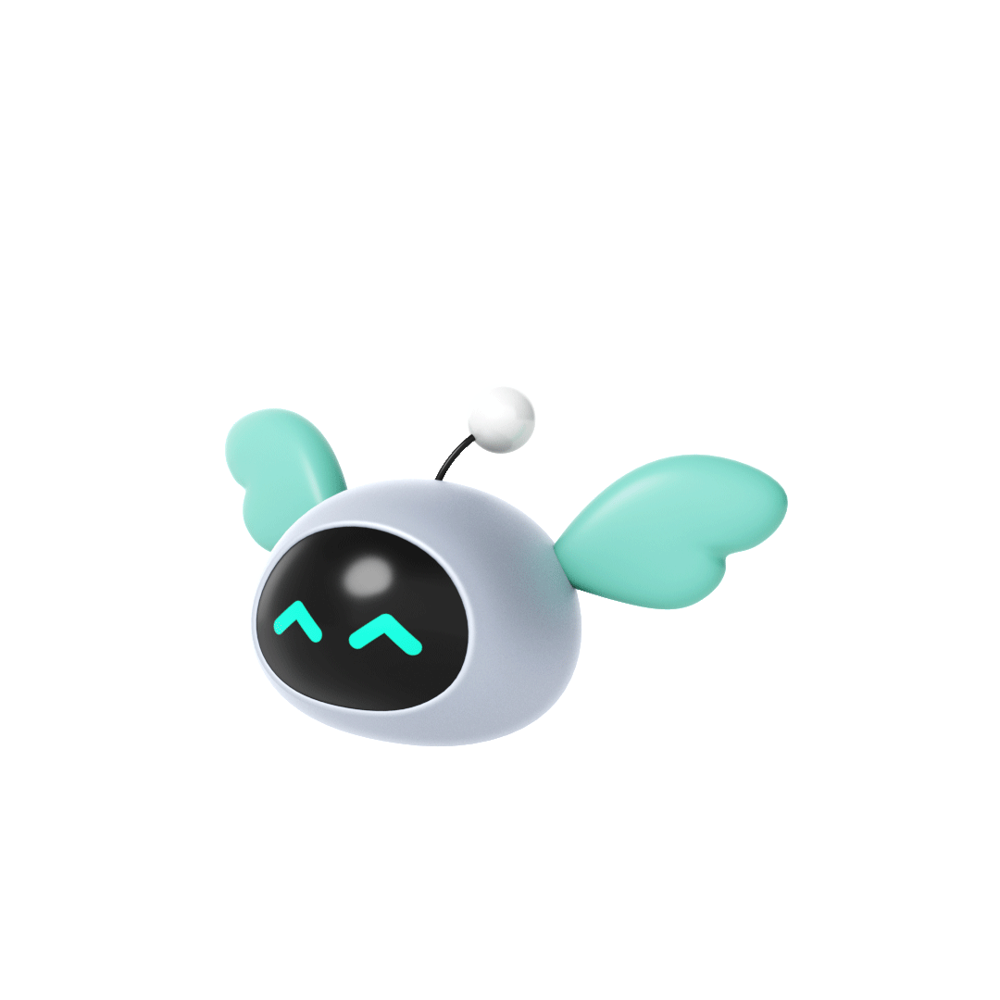

<h1 align="center">Hey 👋, I'm Chaima</h1>

### 💻 About Me  
- 🚀 AI Researcher & Full Stack Developer  
- ⚡ Passionate about **AI, IoT, Robotics, and Cutting-edge Tech**  
- 🌱 Always learning, building, and pushing limits  

---

<h2 align="center">🤝 Connect With Me</h2>

  
  
  

---

<h2 align="center">🛠️ Tech Stack</h2>
### 
                                                                                          
 ### 

<h2 align="center">📊 GitHub Stats</h2>

  
  

  

